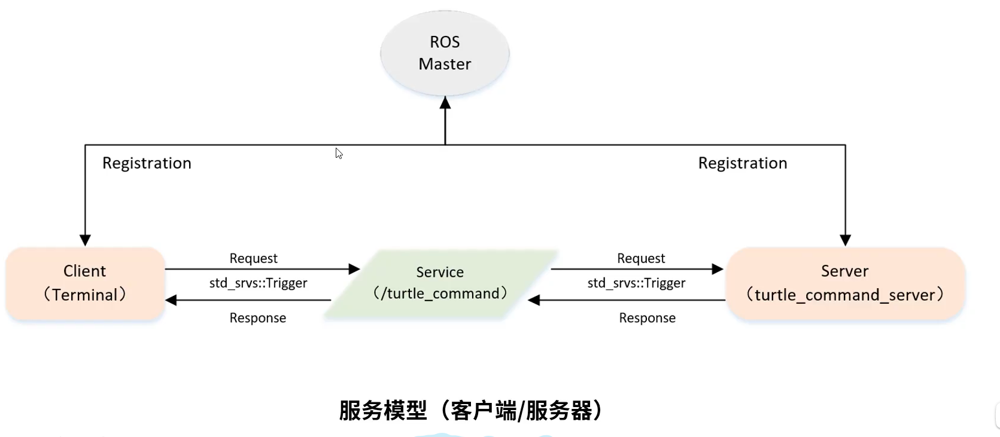
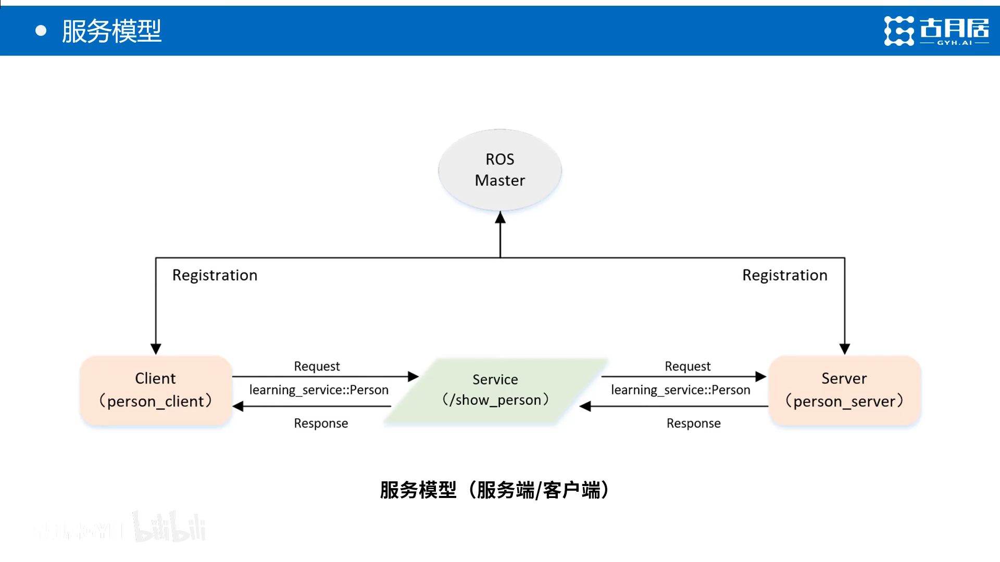
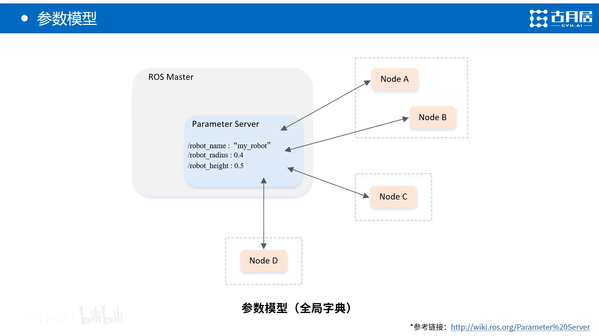

# 零. ROS  结构


## 1. src

存放功能包（package）。

功能包是ROS文件系统中组织程序文件的基本单元，也就是catkin编译的基本单元。一个 package 下必须包含 CMakeLists.txt 和 package.xml 两个文件：

- CMakeLists.txt 文件中规定了功能包的编译规则
  - 指定功能包名称
  - 指定编译依赖项
  - 指定要编译的源文件
  - 指定要添加的消息格式文件/服务格式文件/动作格式文件
  - 指定生成的消息/服务/动作
  - 指定头文件搜索目录，指定链接库搜索目录
  - 指定生成的静态链接库文件
  - 指定需要链接的库文件
  - 指定编译生成的可执行文件以及路径等等
- package.xml 文件定义了功能包的属性信息，包括包名，版本号，作者，编译依赖和运行依赖等。

- include 和 src 分别存放头文件（*.h）和源程序文件（*.c/*.cpp等）；
- scripts 存放脚本文件（比如Python文件 *.py，shell文件 *.sh）；
- launch 存放 launch文件（*.launch），用于批量运行多个可执行文件；
- config 存放配置文件（*.yaml等）；

 此外，还有自定义的通信格式文件，包括消息（*.msg）、服务（*.srv）以及动作（*.action）。 


## 2. build 编译空间

 存放CMake和catkin的缓存信息、配置信息和其他中间文件。 

## 3. devel 开发空间

 存放编译后生成的目标文件，包括头文件、动态&静态链接库、可执行文件等。 

## 4. install 安装空间

 即开发完成后的安装包。  

## 5. 资源文档

```http
http://www.autolabor.com.cn/book/ROSTutorials/chapter1.html
```


# 一 . ROS命令行工具

**常用命令：**

- rostopic
- rosservice 
- rosnode
- rosparam
- rosmsg
- rossrv

-  rqt_graph 

- rosnode   帮助信息 

-  rosnode list   把系统中的所有结点列出来

- rosnode info  查看具体结点信息 

- rostopic   话题相关   帮助信息   

- rostopic list     列出所有话题

- rostopic pub   /话题名   双击tab      只执行一次

- rostopic pub  -r   10     一秒钟发送10次 


- rosmsg   查看帮助信息
- rosmsg    show     查看信息 


- rosservice   list    列出服务内容

- rosservice  call   / 服务         在客户端请求服务  

  

- rosbag  rercord  -a -O cmd_record    话题记录
- rosbag play  cmd_record.bag        话题复现 


- rosbag record   -a (全部 ) -O  (打压缩包)   cmd_record (压缩包的名字 )
- 

# 二， 创建工作空间和功能包


## 1. 创建工作空间


```c
mkdir -p ~/catkin_ws(可以自定义) /src （不可以改名）
    
cd ~ /catkin_ws/src       进入代码空间
catkin_init_workspace     变成工作空间的一个属性   
```

```c
cd~ /catkin_ws/
catkin_make    
```

```c
source   devel/setup.bash 
    
电脑中有很多的可执行文件，帮助电脑找到文件
```

```c
ecgo $ROSPACKAGE_PATH   
```

编译

到工作空间   

```c
catkin_make    生成 两个文件夹  buid  devel  
```

 

```c
catkin_make install   生成 install 文件夹 
```


- 同一 个工作空间下，不允许存在同名功能包
- 不同工作空间下，允许存在同名功能包

## 2. 创建功能包 

创建功能包 

```c
cd ~/ catkin_ws/src 
catkin_create_pkg test_pkg std_msgs rospy roscpp 
catkin_create_pkg  <package_name> [depend1] [depend2] [depend3]
```

编译功能包

```c
cd ~/catkin_ws
catkin_make
source~/catkin_ws/devel/setup.bash
```

# 三. 订阅者Subscriber 的编程实现


- 初始化ROS节点
- 订阅需要的话题
- 循环等待话题消息，接收到消息后进入回调函数
- 在回调函数中完成消息处理

```c++
 
#include <ros/ros.h> //包含了标准ROS类的声明
#include "turtlesim/Pose.h"
#include"std_msgs/String.h" //文本被封装成单独的数据类型了std_msgs功能包里的string.h

// 接收到订阅的消息后，会进入消息回调函数
void poseCallback(const turtlesim::Pose::ConstPtr& msg)
{
    // 将接收到的消息打印出来
     //通过msg获取并操作订阅到的数据
    ROS_INFO("Turtle pose: x:%0.6f, y:%0.6f", msg->x, msg->y);
}

int main(int argc, char **argv)
{
    setlocale(LC_ALL,"");//防止乱码
    // 初始化ROS节点，创建一个节点名字叫"pose_subscriber"，并且节点名字必须唯一
    ros::init(argc, argv, "pose_subscriber");

    // 创建节点句柄
    ros::NodeHandle n;

    // 创建订阅者对象，订阅名为/turtle1/pose的topic，注册回调函数poseCallback
    //\param queue_size 消息队列长度，超出长度时，头部的消息将被弃用
    ros::Subscriber pose_sub = n.subscribe("/turtle1/pose", 10, poseCallback);

    // 循环等待回调函数
    ros::spin();

    return 0;
}

```


# 四. 发布者publish 

## 1. advertise 函数 

```c++
#include "ros/ros.h" //该头文件必须包含
#include "std_msgs/String.h" //ros标准消息里面的字符串消息

#include <sstream>

/**
 * 在一个话题上发布一个简单的字符串消息
 */
int main(int argc, char *argv[])
{
	/**
	 * ros::init()初始化节点函数需要使用argc和argv，不能缺少这两个参数，与话题重映射等有关的
	 */
	ros::init(argc, argv, "study"); //节点名为study，随便取
	
	/**
	 *NodeHandle是与ROS系统通信的主要访问点（句柄）,有了它节点就可以“说话了”（在话题上发布消息）
	 * 构造的第一个NodeHandle将完全初始化该节点，最后一个被析构的NodeHandle将关闭该节点。
	 */
	ros::NodeHandle n;

	/**
	 * advertise()函数是你告诉ROS你想在给定的话题名上发布特定类型的消息。
	 * 在这个advertise()调用之后，master节点将通知任何试图订阅这个话题名称的节点，然后他们将与这个节点建立一个对等网络（peer to peer/P2P）连接。
	 * advertise()括号里面的第一个参数是话题名字，第二个参数是用于发布消息的消息队列的大小。
	 * <>里面指定消息的类型
	 */
	ros::Publisher chatter_pub = n.advertise<std_msgs::String>("chatter", 1000);
	
	/**
	 * 循环频率10Hz
	 */
	ros::Rate loop_rate(10);

	int count = 0;
	while (ros::ok())
	{
		/**
		 * 先创建一个消息对象。然后用数据填充它，最后发布它。
		 * 要查看消息结构在命令行使用rosmsg show std_msgs/String，其它消息类似
		 */
		std_msgs::String msg;

		std::stringstream ss;
		ss << "hello world " << count;
		msg.data = ss.str();

		/**
		 * 在终端打印字符串的内容，消息在ROS里面封装成类，类公有函数这些请去wiki上看API文档
		 */
		ROS_INFO("%s", msg.data.c_str());

		/**
		 * publish()函数是发送消息的函数，参数是消息对象。
		 * 消息类型要与n.advertise<>里面声明的一致。
		 */
		chatter_pub.publish(msg);

		ros::spinOnce();//触发回调函数的，不订阅消息的话可删

		loop_rate.sleep();   //以10Hz循环，循环跑太快就在这里睡一会儿
		++count;
	}

	return 0;
}
```


# 4.1 话题消息的定义与使用

## 1. 自定义话题消息


### 1. 定义msg文件

### 2. 在package.xml 中添加功能包依赖

### 3. 在CMakeLists.txt 添加编译选项

### 4. 编译生成语言相关文件


# 五.客户端Clinent 的编程实现


 


## 如何实现一个客户端

- 初始化ROS节点
- 创建一个Client 实例
- 发布服务请求数据
- 等待Server处理之后的应答结果

## 如何配置CMakeLists.txt 中的编译规则

- 设置需要编译的代码和生成的可执行文件
- 设置链接库

## 可执行文件的位置

catkin_ws / devel/lib/learning-service/


# 六. 服务端server 的编程实现




 

# 七.ros使用基本流程

## 0. 简约理解

总工作空间有：build devel src  三个文件夹

src 中放的是功能包

假如src 中有 px4_com 这个文件，px4_com 为功能包

px4_com 中存放着 include src  scricpts launch 各种文件夹，CMakeLists.txt package.xml

px4_com 功能包中的 launch 文件夹中存放的文件为： .launch 

px4_com 功能包中的 config  文件夹中存放的文件为： .yaml

## 1. 创建ros工作空间

```linux
mkdir -p ~/catkin_ws/src
cd ~/catkin_ws/
catkin_make
```

其中catkin_ws 是自定义的工作空间名，也就是文件夹名

## 2. 将工作空间配置进环境变量

可以使用以下的命令来配置

```linux
source devel/setup.bash
```

也可以直接在,bashrc 里写入

```
source ~/catkin_ws/devel/setup.bash
```


```
vi .bashrc 里面最下面，添加一句话
source /home/hcx/catkin_ws/devel/set.bash 
这样打开终端后会自动sourec 执行脚本  
```


## 3. 创建一个功能包

首先切换到工作空间的src 目录下

```
cd ~/catkin_ws/src
```

再使用catkin_create_pkg命令来创建功能包

```
catkin_create_pkg beginner_tutorials std_msgs rospy roscpp
```

其中，beginner_tutorials 目录下创建了package.xml和CMakeList.txt 两个文件


## 4. 配置package.xml 文件

接下来队package.xml 文件进行配置，package.xml 文件主要由4个标签组成，分别为

**描述标签，维护者标签，许可证标签，依赖项标签。**

```linux
<?xml version="1.0"?>
<package format="2">
  <name>beginner_tutorials</name>
  <version>0.1.0</version>
  <description>The beginner_tutorials package</description>

  <maintainer email="you@yourdomain.tld">Your Name</maintainer>
  <license>BSD</license>
  <url type="website">http://wiki.ros.org/beginner_tutorials</url>
  <author email="you@yourdomain.tld">Jane Doe</author>

  <buildtool_depend>catkin</buildtool_depend>

  <build_depend>roscpp</build_depend>
  <build_depend>rospy</build_depend>
  <build_depend>std_msgs</build_depend>

  <exec_depend>roscpp</exec_depend>
  <exec_depend>rospy</exec_depend>
  <exec_depend>std_msgs</exec_depend>

</package>
```

## 5. 编写ROS 程序

 在 ~/工作空间/src/功能包名 目录下，创建并编辑cpp程序文件(以hello.cpp为例)。运行如下命令： 

```linux
$ cd ~/catkin_ws/src/beginner_tutorials
$ touch hello.cpp
$ gedit hello.cpp
```

hello.cpp 代码如下

```c++
#include <ros/ros.h>

int main ( int argc , char ** argv)
{
  ros::init ( argc , argv , "hello");
  ros::NodeHandle nh;
  ROS_INFO_STREAM( "Hello , ROS! ");
}
```


## 6. 编译ROS 程序

### 1. 声明依赖库

首先，我们需要声明程序所依赖的其他功能包，对于C++程序而言，此步骤是必要的，以确保catkin能够向C++编译器提供合适的标记来定位编译功能包所需要的头文件和链接库。

**为了给出依赖库，我们需要编辑CMakeLists.txt 文件，即修改find_package如下：**

```linux
find_package(catkin REQUIRED COMPONENTS
# 依次写上所依赖的功能包
roscpp
)
```

**同样，我们也需要在package.xml 文件中列出依赖库，由于hello程序在编译时和运行时都需要roscpp 库，故将roscpp添加至build_depend(编译依赖)和exec_depend （运行依赖）,如下**

```linux
<buildtool_depend>catkin</buildtool_depend>

<build_depend>roscpp</build_depend>  编译依赖

<build_export_depend>roscpp</build_export_depend>

<exec_depend>roscpp</exec_depend> 运行依赖
```

### 2. 声明可执行文件

接下来，我们需要在CMakeLists.txt 中添加两行，来声明我们需要创建的可执行文件

第一行：

```linux
add_executable(hello hello.cpp)
```

其中：  hello 为我们想要生成的可执行文件的文件名

 			hello.cpp 是生成hello 可执行文件所需要的源文件，如果有多个源文件

​			  把他们列在此处，并用空格将其区分开。

第二行：

```linux
target_link_libraries(hello ${catkin_LIBRARIES})
```

 作用为告诉Cmake 当链接此可执行文件时需要哪些库。（这些库在find_package 中已经定义了）


### 3. 编译工作区

首先返回工作空间目录，然后使用catkin_make命令进行编译

```
cd ~/catkin_ws 
catkin_make
```

完成编译后，将会在工作区catkin_ws中创建devel 文件夹（此为 开发空间，用来放置编译生成的可执行文件）和build  文件夹 （编译空间，用来储存工作空间编译中产生的缓存信息和中间文件）两个子目录。

### 4. 运行ros程序

hello 程序是一个节点（Node） ,需要节点管理器才可以正常运行，启动节点管理器后，用rosrun命令运行程序。

```
roscore
rosrun beginner_tutorials hello 
```

# 八. roslanunch   launch 文件

## 1. 创建launch 文件流程

    1. 先在功能包中创建 launch 文件夹
       2. 


## 2.为什么要用launch 它的作用是啥？

launch英文翻译过来的意思是“启动”，说明它与启动有关。
作用：rosrun命令用于运行一个ROS节点，这个在简单程序中使用比较方便。但是在规模比较大的程序中，常常有几个或者几十个节点，这些节点之间彼此互有联系，协同达到软件正确执行的目的。这时候再使用rosrun命令的话，就会比较麻烦。此时，roslaunch命令闪亮登场了，它可以运行多个节点。

**0. launch在哪里？**

在工作空间下， 功能包中 launch 文件夹下

launch 文件自动启动roscre 

## 3.launch文件的构成 

指令格式：roslaunch package_name file.launch
扩展名为.launch
文件包括了指定执行哪个包，哪个节点node 、以及他们的参数param

```ros
rosrun package_name executable_file_name
```


## 4.示例讲解

先看一段LDS激光雷达hlds_laser.launch文件的例子本质

```yaml
<?xml version="1.0"?>
<launch>
  <node 
  pkg="hls_lfcd_lds_driver" type="hlds_laser_publisher"                 name="hlds_laser_publisher" output="screen">
  
    <param name="port" value="/dev/ttyUSB0"/>
    <param name="frame_id" value="laser"/>
  </node>
</launch>
```

一行一行往下剖析，代码第一行出现了xml,说明了launch文件的本质是一个xml文件

### 1.launch根元素

第二行是 <launch>结尾是 </launch>
每个XML文件都必须要包含一个根元素。根元素由一对launch标签定义：<launch> … </launch> 元素都应该包含在这两个标签之内。

### 2. node节点  属性介绍

- pkg：是工作空间中节点包的名称
- type：是包中需要运行的具体节点，其指向的文件必须有对应的可执行文件（**节点的可执行文件名称，容易h和name绕晕**）
- name：是给这个节点运行时候的名字（取代源文件的名称）
- output：是否打印日志信息，某个单独的节点在控制台中输出信息，只需在节点元素中配置output="screen"配置了该属性的节点会将标准输出显示在屏幕上而不是记录到日志文档。
- param参数服务器
  <param ..../> 设置ROS系统运行中的参数,存储在参数服务器中。

- name:参数名
- value:参数值
  这个在ROS的CPP代码里面有相关体现

```yaml
  priv_nh.param("port", port, std::string("/dev/ttyUSB0"));
  priv_nh.param("baud_rate", baud_rate, 230400);
  priv_nh.param("frame_id", frame_id, std::string("laser"));
```


## 5. param ，rosparam,arg的区别


​	param， rosparm 以及arg 都是对lauch 文件中的参数进行设置，下面说说她们三个之间的区别

param 和 rosparam 两个参数调用差不多，都是把launch文件中的一些参数直接设置到 rosmaster （ros中的节点管理器)  里面以便于各个节点的使用，

主要不同在于param 只对一个参数进行操作

```xml
<param name="name"   value="ture"/>
```


rosparam可以对多个参数进行操作，前提时把这些参数放到.yaml文件中，使用方式如下：

```xml
<rosparam file="param.yaml" command="load"/>
```


arg是把参数用在launch文件内部来使用，把launch文件看作是脚本的话，arg类似这个脚本里面设置变量的语法、语句，使用方式如下：

```xml
<arg name="arg-name"  default="arg-value" />

调用： 
<param name= "foo" value="$(arg arg-name)"/>
<node name = "node" pkg= "package" type= "type" args="$(arg arg-name)" />
```

这只是基本的使用方式，里面还可以添加其它的，比如ns（命名空间），也可以将arg嵌套param当中，如下：

```xml
<rosparam file="$(find xpkg)param.yaml" command="load" ns="params"/>
```


## 6. 怎么加注释

```yaml
<!--  这就是注释  -->
```

1
附件
LDS的下载位置

参考
1.ROS环境下launch文件格式说明
2.ROS launch的基本实现模板
 [(8条消息) ROS中的launch文件究竟是个啥_kay880的博客-CSDN博客_launch文件是什么](https://blog.csdn.net/ben_xiao_hai_123/article/details/119250218) 

# 九. shell启动脚本


## 1.my_deliver_goods.sh解析


```shell
#!/bin/bash
source /opt/ros/melodic/setup.bash
source ~/uav_ws/devel/setup.bash
gnome-terminal --window -e 'bash -c "roscore; exec bash"' \
--tab -e 'bash -c "sleep 5; roslaunch mavros px4.launch fcu_url:="/dev/ttyTHS1:921600" gcs_url:="udp://@192.168.43.68"; exec bash"' \
--tab -e 'bash -c "sleep 5; roslaunch usb_cam usb_cam-test.launch; exec bash"' \
--tab -e  'bash -c "sleep 5; roslaunch darknet_ros darknet_ros.launch; exec bash"' \
--tab -e 'bash -c "sleep 6; roslaunch px4_command deliver_goods.launch; exec bash"' \
```


新

```shell
#!/bin/bash

gnome-terminal -t "roscore" -x bash -c "roscore;exec bash;"
sleep 1s
gnome-terminal -t "ros_server" -x bash -c "roslaunch rosbridge_server rosbridge_websocket.launch;exec bash;"
sleep 1s
gnome-terminal -t "tf2" -x bash -c "rosrun tf2_web_republisher tf2_web_republisher;exec bash;"
```


gnome-terminal -t " title-name" -x bash -c " sh ./run.sh;exec bash;"

-t 为打开终端的标题，便于区分。
-x 后面的为要在打开的终端中执行的脚本，根据需要自己修改就行了。
最后的exec bash;是让打开的终端在执行完脚本后不关闭。


# 十. 服务数据的定义与使用

## 1. 服务模型：



##  2. 如何自定义服务数据


三条横线，上面是requst 下面是response 


# 11. 参数的使用与编程方法

## 1. 参数模型




# 12. 处理yaml 文件

ros中的参数服务器 parameter Server 

如果想载入参数，可以通过编写yaml 文件，然后在launch文件中加入

```xml
<rosparam file="$(find readyaml)/rosYaml.yaml" command="load"/>
```

command 参数：

1. command= "load "  ： 从YAML 文件中加载一批param 
2. command= "delete "   删除某个 param 
3. 


# 13. c++ 和python  订阅者和发布者 不同点


## 1. c++ 和python 订阅者


c++ 订阅者

```c++
/*  
    订阅小乌龟的位姿: 时时获取小乌龟在窗体中的坐标并打印
    准备工作:
        1.获取话题名称 /turtle1/pose
        2.获取消息类型 turtlesim/Pose
        3.运行前启动 turtlesim_node 与 turtle_teleop_key 节点

    实现流程:
        1.包含头文件
        2.初始化 ROS 节点
        3.创建 ROS 句柄
        4.创建订阅者对象
        5.回调函数处理订阅的数据
        6.spin
*/

#include "ros/ros.h"
#include "turtlesim/Pose.h"

void doPose(const turtlesim::Pose::ConstPtr& p){
    ROS_INFO("乌龟位姿信息:x=%.2f,y=%.2f,theta=%.2f,lv=%.2f,av=%.2f",
        p->x,p->y,p->theta,p->linear_velocity,p->angular_velocity
    );
}

int main(int argc, char *argv[])
{
    setlocale(LC_ALL,"");
    // 2.初始化 ROS 节点
    ros::init(argc,argv,"sub_pose");
    // 3.创建 ROS 句柄
    ros::NodeHandle nh;
    // 4.创建订阅者对象
    ros::Subscriber sub = nh.subscribe<turtlesim::Pose>("/turtle1/pose",1000,doPose);
    // 5.回调函数处理订阅的数据
    // 6.spin
    ros::spin();
    return 0;
}

```


python 订阅者

```python
#! /usr/bin/env python
"""
    订阅小乌龟的位姿: 时时获取小乌龟在窗体中的坐标并打印
    准备工作:
        1.获取话题名称 /turtle1/pose
        2.获取消息类型 turtlesim/Pose
        3.运行前启动 turtlesim_node 与 turtle_teleop_key 节点

    实现流程:
        1.导包
        2.初始化 ROS 节点
        3.创建订阅者对象
        4.回调函数处理订阅的数据
        5.spin

"""

import rospy
from turtlesim.msg import Pose

def doPose(data):
    rospy.loginfo("乌龟坐标:x=%.2f, y=%.2f,theta=%.2f",data.x,data.y,data.theta)

if __name__ == "__main__":

    # 2.初始化 ROS 节点
    rospy.init_node("sub_pose_p")

    # 3.创建订阅者对象
    sub = rospy.Subscriber("/turtle1/pose",Pose,doPose,queue_size=1000)
    #     4.回调函数处理订阅的数据
    #     5.spin
    rospy.spin()
```


## 2. c++ 和python 发布者 


c++  发布者

```c++
/*
    编写 ROS 节点，控制小乌龟画圆

    准备工作:
        1.获取topic(已知: /turtle1/cmd_vel)
        2.获取消息类型(已知: geometry_msgs/Twist)
        3.运行前，注意先启动 turtlesim_node 节点

    实现流程:
        1.包含头文件
        2.初始化 ROS 节点
        3.创建发布者对象
        4.循环发布运动控制消息
*/

#include "ros/ros.h"
#include "geometry_msgs/Twist.h"

int main(int argc, char *argv[])
{
    setlocale(LC_ALL,"");
    // 2.初始化 ROS 节点
    ros::init(argc,argv,"control");
    ros::NodeHandle nh;
    // 3.创建发布者对象
    ros::Publisher pub = nh.advertise<geometry_msgs::Twist>("/turtle1/cmd_vel",1000);
    // 4.循环发布运动控制消息
    //4-1.组织消息
    geometry_msgs::Twist msg;
    msg.linear.x = 1.0;
    msg.linear.y = 0.0;
    msg.linear.z = 0.0;

    msg.angular.x = 0.0;
    msg.angular.y = 0.0;
    msg.angular.z = 2.0;

    //4-2.设置发送频率
    ros::Rate r(10);
    //4-3.循环发送
    while (ros::ok())
    {
        pub.publish(msg);

        ros::spinOnce();
    }


    return 0;
}

```


python 发布者

```python
#! /usr/bin/env python
"""
    编写 ROS 节点，控制小乌龟画圆

    准备工作:
        1.获取topic(已知: /turtle1/cmd_vel)
        2.获取消息类型(已知: geometry_msgs/Twist)
        3.运行前，注意先启动 turtlesim_node 节点

    实现流程:
        1.导包
        2.初始化 ROS 节点
        3.创建发布者对象
        4.循环发布运动控制消息

"""

import rospy
from geometry_msgs.msg import Twist

if __name__ == "__main__":
    # 2.初始化 ROS 节点
    rospy.init_node("control_circle_p")
    # 3.创建发布者对象
    pub = rospy.Publisher("/turtle1/cmd_vel",Twist,queue_size=1000)
    # 4.循环发布运动控制消息
    rate = rospy.Rate(10)
    msg = Twist()
    msg.linear.x = 1.0
    msg.linear.y = 0.0
    msg.linear.z = 0.0
    msg.angular.x = 0.0
    msg.angular.y = 0.0
    msg.angular.z = 0.5

    while not rospy.is_shutdown():
        pub.publish(msg)
        rate.sleep()

```


