# ros机器人

<u>*svn*</u>

**svn是用于代码管理 使用svn可以将代码上传到svn服务器上，若想使用该代码，可以从svn服务器上下载，可以实现更新，上传，提交等功能。**

<u>*git*</u>

**GIT，全称是分布式版本控制系统，git通常在编程中会用到，并且git支持分布式部署，可以有效、高速的处理从很小到非常大的项目版本管理。分布式相比于集中式的最大区别在于开发者可以提交到本地，每个开发者通过克隆（git clone），在本地机器上拷贝一个完整的Git仓库。**

**想必大家看到这样官方的解释，估计还是一头雾水！**

**下面我们可以举一个通俗易懂的例子。**

**比如当你在本地写好某一个编程文档时，发现有些地方需要修改或者删除，有的人可能会直接在当前文件中直接修改，有的人会复制一份在上面修改，然后删除没用的文件。但是当你发现还是原来的文件好或者另外的版本好时，就可能手足无措了。**

**此时使用git工具，就是聪明之举了。我们可以在本地建一个版本库，每当我们需要修改时，就可以把之前的版本提交并标明此版的特点。这样文件夹里就只有一个编程文档了。当你需要哪个版本时，只要在版本库中恢复一下就可以了。**

*<u>节点</u>*

**节点是主要的计算机执行进程，如果你想要有一个可以与其他节点进行交互的进程，那么你需要创建一个节点，并将此节点连接到ROS网络，通常情况下，系统包含能够实现不同功能的多个节点。你最好让每一个节点都具有特定的单一的功能，而不是在系统中去创建一个包罗万象的大节点。节点需要使用如roscpp或rospy的ROS客户端库进行编写。**

<u>*节点管理器*</u>

**节点管理器用于节点的名称注册和查找等，如果在你的整个ROS系统在没有节点管理器。就不会有节点，服务，消息之间的通信。需要注意的是，由于ROS本身就是一个分布式网络系统，你可以在某一台计算机上运行节点管理器，在其他计算机上运行由该管理器管理的节点**

<u>*参数服务器*</u>

**参数服务器能够使数据通过关键词储存在一个系统的核心位置，通过使用参数，就能在运行时配置节点或改变节点的工作任务**

*<u>消息</u>*

**节点通过消息完成彼此的沟通。消息包含一个节点发送到其他节点的数据信息，ROS中包含很多种标志类型的消息，同时你也可以基于标准消息开自定义类型的消息** 

*<u>主题</u>*

**主题是ROS网络对消息进行路由，和消息管理器的数据总线。每一天消息都要发布到相应的主题。<u>当一个节点发送数据时，我们就说该节点正在向主题发布消息。节点可以通过订阅某个主题，接受来自其他节点的消息。一个节点可以订阅一个主题，而并不需要该节点同时发布该主题。</u>**

**这就保证了消息的发布者和订阅者之间的相互解耦，无需知晓对方的存在。主题的名称必须是独一无二的，否则在同名主题之间的消息路由就会发送错误。**

*<u>服务</u>*

**在发布主题时，正在发送的数据能够以多对多的方式交互。但当你需要从某个节点获得一个请求或应答时。就不能通过主题来实现了。在这种情况下。服务能够允许我们直接于某个节点进行交互。此外，服务必须有一个唯一的名称。当一个节点提供某个服务时，所有的节点都要可以过ROS客户端库所编写的代码与它通信。**

*<u>消息记录包</u>*

消息记录包是一种用与保存和回放ROS消息数据的文件格式。消息记录包是一种用于储存数据的重要机制。他能够获取并记录各种难以收集的传感器数据。我们可以通过消息记录包反复获取实验数据。进行必要的开发和算法测试，在使用复杂机器人进行实验工作室，需要经常使用到消息记录包。

**节点**

节点都是各自可执行的文件，通过主题，服务，或参数服务器与其他进程（节点）通信，ROS通过使用节点将代码或功能解耦，提高了系统容错能力和可维护性，是系统简化，同时，节点与允许ROS系统能够布置在任意多个机器人并同时运行。

节点在系统中必须有唯一的名称，节点使用特定名称与其他节点经行通信而不产生歧义。节点可用用不同的库进行编写。如roscpp , rospy  。roscpp 基于c++.而rospy 基于puthon。

- rosnode info node 		输出当前节点信息
- rosnode  kill node           结束当前运行节点进程或发送给定信号
- rosnode list                    列出当前活动节点
- rosnode  machine hostname    列出某一特定计算机运行的节点，或列出主机名称
- rosnode ping node        测试节点的连通性
- rosnode cleanup           将无法访问节点的注册信息清楚

**主题**

主题是节点间用来传输数据的总线。通过主题进行消息路由不需要节点之间的直接连接。这就意味着发布者与订阅者之间不需要知道彼此是否存在， 同一个主题也可以有很多个订阅者。

每个主题都是强类型的，发布到主题上的信息必须与主题ROS消息类型相匹配。并且节点只能接收类型匹配的消息。一个节点想要订阅一个主题，它们就必须具有相同的消息类型。

ROS的主题可以使用TCP/IP,UDP传输，基于TCP称为TCPROS，它使用TCP/IP长连接，这是ROS默认的传输方式。

基于UDP传输称为UDOROS，它是一种低延时高效率的传输方式，但可能产生数据丢失，所以它适合与远程操纵任务。

ROS有一个rospic工具用于主题操作，它是一个命令行工具，允许我们获取主题的相关信息或在网络上发布数据

此工具的参数为：

- rostopic bw /topic        显示主题所使用的带宽
- rostopic echo  /topic       将信息输出到屏幕
- rostopic find message_type    按照类型查找主题
- rostopic hz /topic      显示主题的发布率
- rostopic info  /topic      输出活动的主题，发布的主题，主题订阅者和服务的信息
- rostopic list                 输出活动主题的列表
- rostopic pub /topic   type   args      将数据发布到主题，它允许我们直接从命令行对任意主题创建和发布数据
- rostopic  type /topic            输出主题的类型。或者说主题种发布的消息类型

**服务**

当你需要直接与节点通信并获得应答时，将无法通过主题实现，而需要使用服务。

服务需要由用户开发，节点并不提供标准服务，包含消息的源代码文件储存在stv文件夹中。

像主题一样，服务关联在一个功能包中，.srv 文件名称的组合。

ROS关于服务的命令行工具有两个：rossrv 和rosservice 。我们可以通过rossrv看到有关服务数据结构的信息，并且与rosmsg具有完全一致的用法，通过rosserice 可以

列出服务列表和查询某个服务，命令如下


- rosservice call  /service args   根据命令行参数调用服务
- rosservice find msg-type  根据服务类型查询服务
- rosservice info  /service  输出服务信息
- rosservice  list  输出活动服务清单
- rosservice type /service 输出服务类型
- rosservice uri /service  输出服务的ROSRPC URI

**消息**

一个节点通过向特定主题发布消息，从而将数据发送到另一个节点。消息具有一点过的类型和数据结构，包括ros提供的标志类型和用户自定义类型。

消息的类型在ROS中按照以下标准命名方式进行约定，

功能包名称/.msg文件名称。

例如 sta_msgs/msg/String.msg   的消息类型是 std_msgs/String 

ROS使用命令行工具rosmsg 来获取有关消息的信息。惯用参数如下所示：

- rosmsg  show 显示一条消息的字段
- rosmsg list  列出所有消息
- rosmsg  package  列出功能包的所有消息。
- rosmsg   users   搜索使用该消息类型的代码文件
- rosmsg  md5  显示一条消息的MD5求和结果

**消息记录包**

消息记录包是由ROS创建的一组文件，它使用.bag 格式保存消息，主题，服务，和其他的ROS数据消息，你可以在事件发生后，通过使用可视化工具调用和回放数据，检测在系统中到底发生了什么，你可以播放，停止，后退及执行其他操作。

记录包文件可以像实时会话一样在ROS中再现场景，再相同时间向主题发送相同的数据。通常情况下。我们可以使用此功能来调试算法，若绕使用记录包文件，我们可以使用以下ROS工具：

- rosbag   用来录制，播放和执行其他操作
- rxbag     用于可是化图形环境中的数据
- rostopic 帮助我们看到节点发送的主题

**节点管理器**

ROS节点管理器向ROS系统中其他节点提供命名和注册服务，它像服务一样跟踪和记录主题的发布者和订阅者。节点管理器的作用是使ROS节点之间能够相互查找。一旦这些节点找到了彼此，就能建立一种点对点的通信方式。

节点管理器还提供了参数服务器，节点管理器通常使用roscore命令运行，它会加载ROS节点管理器及其他ROS核心组件

**参数服务器**

 参数服务器是可通过网络访问的共享的多变量字典。节点使用此服务来储存和检索运行时参数

参数服务器使用XML-RPC 实现并再ROS节点管理器下运行。这意味着它的API可以通过通用的XMLRPC库进行访问

参数服务器使用XMLRPC数据类型为参数赋值，包括以下类型：

- 32为整数

- 布尔值

- 字符串

- 双精度浮点

- ISO  861 日期

- 列表  List

- 基于64位编码的二进制数据

  ROS中关于参数服务器的工具是rosparam 。其支持的参数如下：

  - rosparam list 列出了服务器中所有的参数
  - rosparam get parameter 获取参数值
  - rosparam  set parameter  value  设置参数
  - rosparam delete parameter     删除参数
  - rosparam  dump  file   将参数服务保存到一个文件
  - rosparam load  file    加载参数文件到参数服务


## ros工作空间

​    src 代码空间，build 编译空间，devel  开发空间 （开发中）install 安装空间 （开发后）   

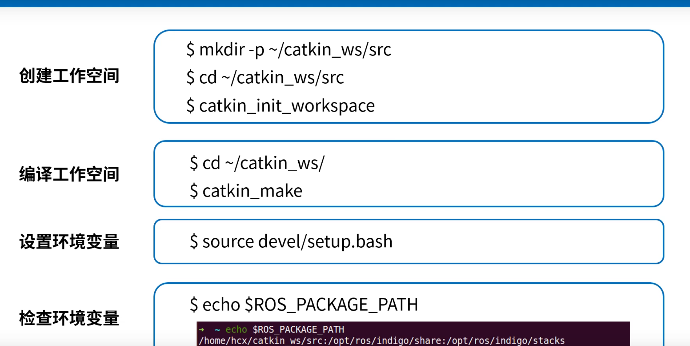

（设置环境变量，检测环境变量可省略）

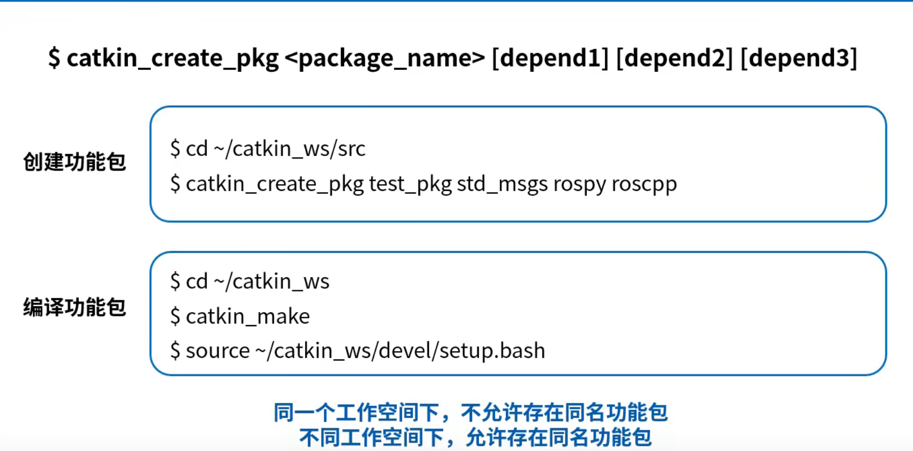

- 功能包，是ros系统中放置源码的最小的工作空间。这些功能包都要放在src文件中

- ```c
  catkin_creat_pkg text_pkg roscpp rospy std_msgs
  ```

- ​       text_pkg  此为 功能包的名称    roscpp  依赖包，c++的依赖包，编译此程序需要依赖的，rospy是python的依赖包，std_msgs 此为ros定义的标志消息结构(int,,,,,,,,,).

- ```c
  1创建工作空间
  
  2编译工作空间
  
  3创建功能包
  
  4编译功能包
  
  5检查环境变量
  ```

  1.创建工作空间，初始化工作空间

  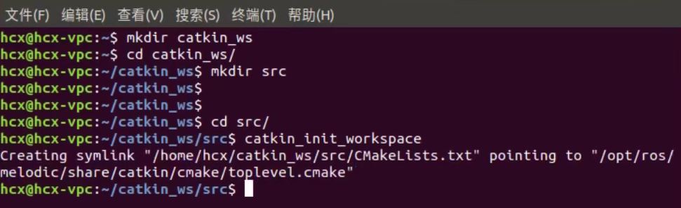

​       2 .  编译工作空间，**注意要回到根目录（catkin_ws）**    ,(cd..回到上一级) （pwd 查看当前路径）(home/hcx/catkin_ws 此为根目录)(catkin_make 编译工作空间)

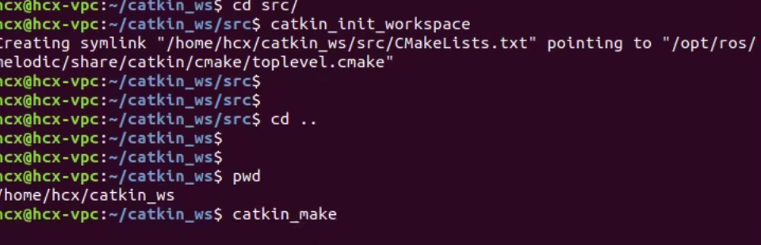

3. 产生Install 安装空间（开发最后，放置最终编译生成的可执行的文件）（devel 开发中产生的文件）两者功能类似

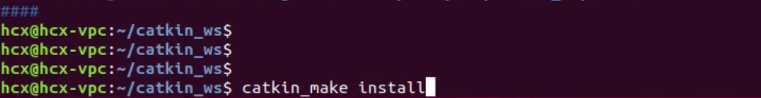

4 。设置环境变量


5. 检查环境变量

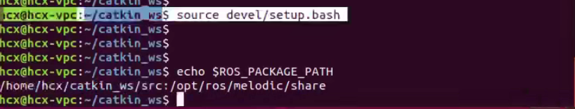

6  这两个文件是任何功能包都会包含的文件

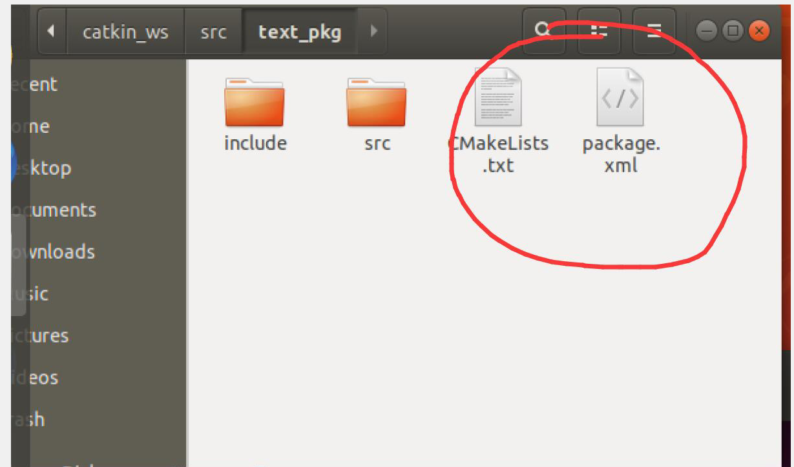

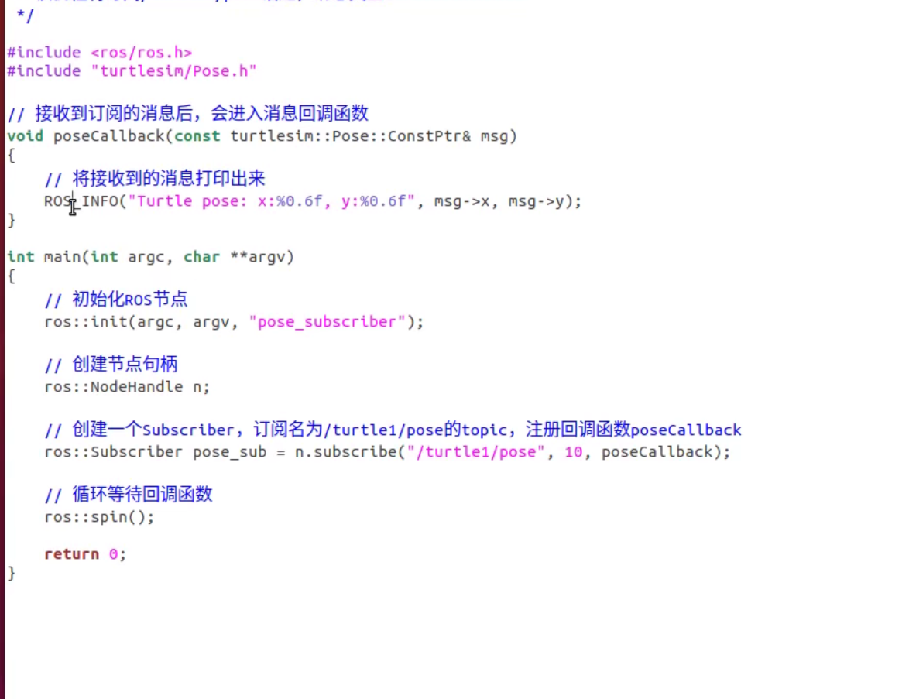

```c++

//该例程将订阅/turtle1/pose 话题，消息类型为turtlesim::pose

#incluce <ros/ros.h>
#include "turtlesim/pose.h"

// 接受到订阅的消息后，会进入消息回调函数
void poseCallback(const turtlesim::Pose::ConstPt)
{    //将接受到的消息打印出来
    ROS_INFO("Turtle pose: x:%0.6f",msg->x,msg->y);
}
int main(int argc,char **argv)
{   // 初始化ROS节点
    ros::init(argc,ragv,"pose_subscribler");
    // 创建节点句柄
    ros::NodeHandle n;
    
    //创建一个subscribel ,订阅名为/turtle1/pose的topic,注册回调函数poseCallback
    ros::Subscriber pose_sub = n.subscrible("/turtle1/pose",10,poseCallback);
    // 循环等待回调函数
    ros::spin();
    return 0;
}
```

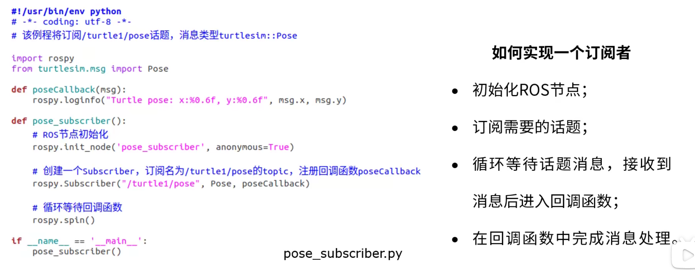

## 客户端

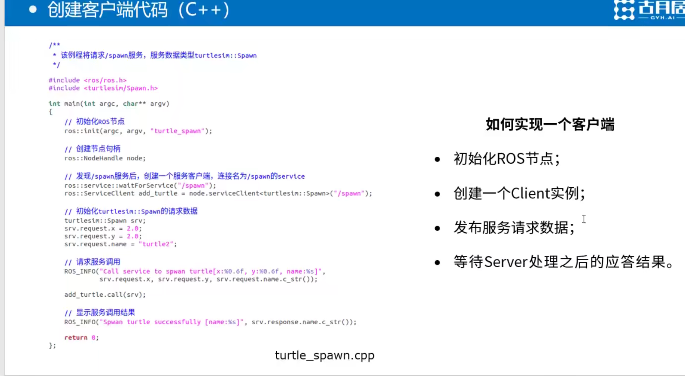

## 发布者publish

```c++

/***********************************************************************
Copyright 2020 GuYueHome (www.guyuehome.com).
***********************************************************************/

/**
 * 该例程将发布/person_info话题，自定义消息类型learning_topic::Person
 */
 
#include <ros/ros.h>
#include "learning_topic/Person.h"

int main(int argc, char **argv)
{
    // ROS节点初始化
    ros::init(argc, argv, "person_publisher");

    // 创建节点句柄
    ros::NodeHandle n;

    // 创建一个Publisher，发布名为/person_info的topic，消息类型为learning_topic::Person，队列长度10
    ros::Publisher person_info_pub = n.advertise<learning_topic::Person>("/person_info", 10);

    // 设置循环的频率
    ros::Rate loop_rate(1);

    int count = 0;
    while (ros::ok())
    {
        // 初始化learning_topic::Person类型的消息
    	learning_topic::Person person_msg;
		person_msg.name = "Tom";
		person_msg.age  = 18;
		person_msg.sex  = learning_topic::Person::male;

        // 发布消息
		person_info_pub.publish(person_msg);

       	ROS_INFO("Publish Person Info: name:%s  age:%d  sex:%d", 
				  person_msg.name.c_str(), person_msg.age, person_msg.sex);

        // 按照循环频率延时
        loop_rate.sleep();
    }

    return 0;
}


```


## 订阅者subscriber

```c++
#include <ros/ros.h>
#include "learning_topic/Person.h"


//接收到订阅的消息后，会进入消息回调函数
void personInfoCallback(const learning_topic::Person::ConstPtr& msg)
{
		//将接收到的消息打印出来
    	ROS_INFO("Subcribe Person Info: name:%s age:%d sex:%d",
                msg->name.c_str(),msg->age,msg->sex);
        
}
int main(int argc,char **argv)
{
    // 初始化ROS节点
    ros::init(argc,argv,"person_subscriber");
    //创建节点句柄
    ros::NodeHandel n;
    
    // 创键一个Subscrible,订阅名为/person_info的topic，注册回调函数personInfoCallback
    ros::Subscriber person_info_sub = n.subscribe("/person_info",10,personInfoCallback);
    
    //循环等待回调函数
    ros::spin();
    
    
    return 0;
    
}
```

## 话题消息的定义与使用


## 参数的使用与编程方法

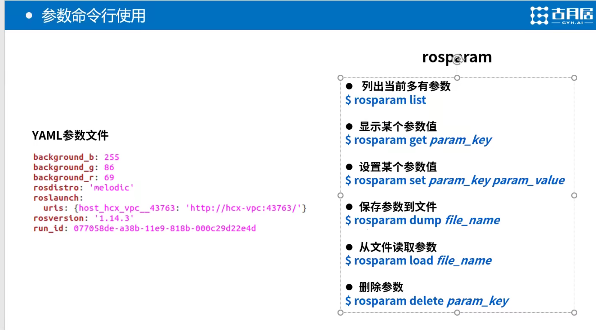

```c

// 参数命令行使用

rosparam list 列出当前多有参数

    rosparam get param_key  显示某个参数值
    rosparam set param_key param_value  设置某个参数值
   
```

# 安装ros

1 更改镜像源 ：

https://blog.csdn.net/weixin_44417398/article/details/121876024?ops_request_misc=%257B%2522request%255Fid%2522%253A%2522164272401416780357290814%2522%252C%2522scm%2522%253A%252220140713.130102334.pc%255Fall.%2522%257D&request_id=164272401416780357290814&biz_id=0&utm_medium=distribute.pc_search_result.none-task-blog-2~all~first_rank_ecpm_v1~rank_v31_ecpm-11-121876024.pc_search_result_control_group&utm_term=ubuntu16.04%E5%AE%89%E8%A3%85ros&spm=1018.2226.3001.4187

配置[Ubuntu](https://so.csdn.net/so/search?q=Ubuntu&spm=1001.2101.3001.7020)软件仓库(configure your ubuntu repositories)
配置Ubuntu 软件仓库(repositories) 安装模式（开启"restricted"、"universe" 和 "multiverse"这三种）

在软件更新换为中国服务器后 更换源后

(1) 添加源（setup your sources.list）
新建一个terminal(控制台),输入以下命令：
用了第三个科大的源成功了。

```c
sudo sh -c 'echo "deb http://packages.ros.org/ros/ubuntu $(lsb_release -sc) main" > /etc/apt/sources.list.d/ros-latest.list'
sudo sh -c 'echo "deb https://mirrors.tuna.tsinghua.edu.cn/help/ubuntu/ $(lsb_release -sc) main" > /etc/apt/sources.list.d/ros-latest.list'
sudo sh -c 'echo "deb http://mirrors.ustc.edu.cn/ros/ubuntu/ $(lsb_release -sc) main" > /etc/apt/sources.list.d/ros-latest.list'
```

(2) 添加秘钥（set up your keys）

```C
sudo apt-key adv --keyserver hkp://ha.pool.sks-keyservers.net:80 --recv-key 421C365BD9FF1F717815A3895523BAEEB01FA116
```

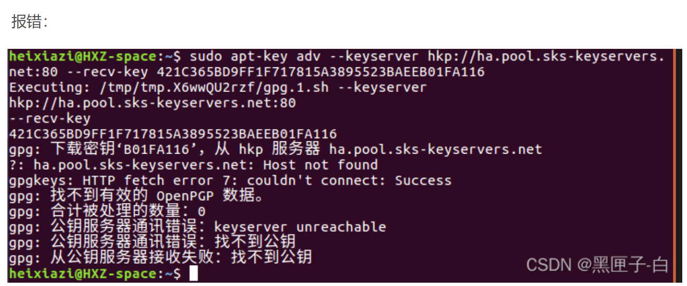

解决：

  导入

```C
gpg --keyserver hkp://keyserver.ubuntu.com:80 --recv-keys 988C2166
 
gpg: 下载密钥‘988C2166’，从 hkp 服务器 keyserver.ubuntu.com
gpg: 密钥 988C2166：公钥“Daniel Kiper <dkiper@net-space.pl>”已导入
gpg: 需要 3 份勉强信任和 1 份完全信任，PGP 信任模型
gpg: 深度：0 有效性：  1 已签名：  0 信任度：0-，0q，0n，0m，0f，1u
gpg: 合计被处理的数量：1
gpg:           已导入：1  (RSA: 1)
```

加入

```C
sudo gpg --armor --export 988C2166 | sudo apt-key add -
 
OK
```

(3) 更新package

```
sudo apt-get update
```

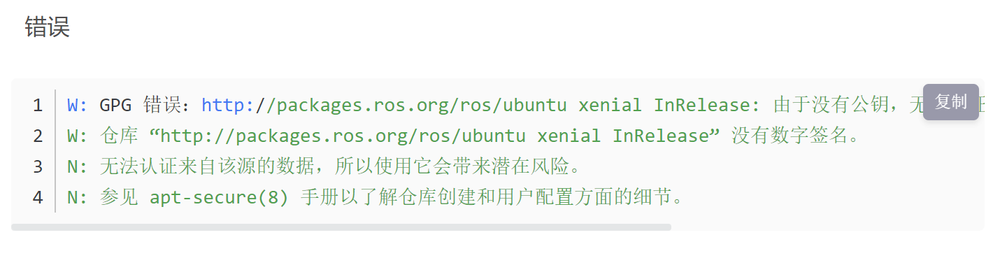

解决

```c
sudo apt-key adv --keyserver keyserver.ubuntu.com --recv-keys F42ED6FBAB17C654
# 注意：最后的码，根据不同的电脑进行修改，即F42ED6FBAB17C654和上面对应
```

(4) 安装ROS kinetic完整版

```c
sudo apt-get install ros-kinetic-desktop-full
```

(5) 初始化rosdep
在使用ROS之前必须要初始化rosdep

```c
sudo rosdep init
rosdep update
```

  注意在  初始化  rosdep  时，经常出现错误

  解决方法 ：

[ROS rosdep init/update百分百解决 (qq.com)](https://mp.weixin.qq.com/s/mghnF4sesImHpg4ScZ-bRA)


（7） 环境配置（将ROS环境配置到~/.bashrc文件中）

```c
$ echo "source /opt/ros/kinetic/setup.bash" >> ~/.bashrc
$ source ~/.bashrc
```

（8） 安装rosinstall

```
sudo apt install python-rosinstall python-rosinstall-generator python-wstool build-essential
```

（9）测试是否安装成功（小海龟）

 启动ROS Master：打开一个终端 （Ctrl+Alt+T） 

```c
roscore
```

启动海龟仿真器:再打开一个终端 输入（会弹出如下窗口）

```c
rosrun turtlesim turtlesim_node
```

启动海龟控制节点:打开第三个终端 输入

```
rosrun turtlesim turtle_teleop_key
```

